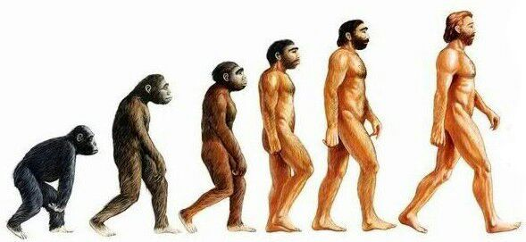
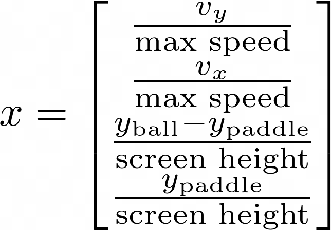
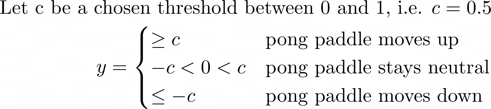
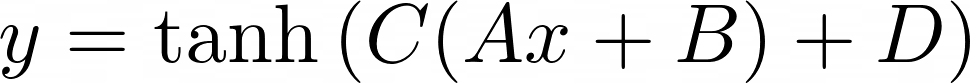

<iframe width="560" height="315" src="https://www.youtube.com/embed/mFOKdGye7vY?si=sZ30L3uJBAeZhTZl" title="YouTube video player" frameborder="0" allow="accelerometer; autoplay; clipboard-write; encrypted-media; gyroscope; picture-in-picture; web-share" referrerpolicy="strict-origin-when-cross-origin" allowfullscreen></iframe>

# Introduction

A well-defined problem is the first step when coming up with a model.
Then, a problem is modeled with mathematics and then algorithims are used to **optimize** this model to its **best parameters**.
The specific problem we are looking at in this blog is the problem of playing pong algorithimically and unsupervised.
In this blog we are covering one specific type of unsupervised learning algorithim: the genetic algorithim.
Genetic algorithms are an algorithim introduced in 1960 by John Holland inspired by Darwin's theory of evolution.
I will first define the context we are appying the algo to understand the model and why we even need this algo in the first place and then I will include an implementation of the algo later in the blog.
I assume the reader has a basic understanding of linear algebra (linear algebra equations).


# Modeling The Problem

In this section we are solving the sub-problem of coming up with the inputs and outputs of our model such that we get a model that will suit our specific task of figuring out when to move a pong paddle up or down in relation to the game state.

**The problem** - Designing a function that takes any given information from the game state that outputs the ideal action. Mathematically what this model looks like is a function with a domain (input values) that spans the game state and a range (output values) that spans the possible actions.

## How do we model?

A model has input features and outputs which are designed based on what the problem specifies. We will be using linear algebra to drive the "unknown" part of this model.

```
i.e. y = Ax+B
x - game state
y - outputs
A, B - unknown
```

## The game state (inputs)

Since the pong game is written in python we have direct memory access to the ball and paddle speed and direction in the x/y direction which we will be using in the engineering of the inputs/game state. The game state will change every frame of the game which will plug into the model to decide the optimal output. The inputs are normalized to reduce weight explosions when optimizing.
*Note: Max Speed and Screen Height are constants defined in the code and could be changed*



## The actions (outputs)

The outputs for **the problem** is the pong paddle's direction of action.



## Algebra of a Neural Network

I used a simple neural network with one set of hidden layers to model the behavior of the paddle.

Dimensions of variables

*Note: hidden layers is a constant*

```
x: 4x1 (game state/domain)
y: 1x1  (actions/range)
A: # hidden layers x 4 (unknown weights)
B: # hidden layers x 1 (unknown bias)
C: 1 x # hidden layers (unknown weights)
D: 1x1 (unknown bias)
```

This is the model I engineered after a few attempts including linear regression. The weights and bias A, B, C, D are all unknown and will be optimized for in the next section of the blog.

# The Genetic Algorithim

## Why is this even necessary?

As I mentioned in the previous section, we have 4 weights and bias terms that we need to optimize for yet we don't have a labeled data set that represents what a pong player should do depending on these inputs. This will require the usage of an unsupervised learning algorithim which will evaluate the progress of learning through a different heuristic.

## What is a chromosome (genetic algorithim)?

## Contents

* A chromosome which expresses a possible solution to the problem as a string
* A fitness function which takes a chromosome as input and returns a higher value for better solution(much more likely to reproduce)
* A population which is just a set of many chromosomes
* A selection method which determines how parents are selected for breeding from the population
* A crossover operation which determines how parents combine to produce offspring
* A mutation operation which determines how random deviations manifest themselves

## What's the heurstic that drives you to a solution?

Genetic algorithims rely on a fitness heurstic which is a function that takes a chromosome and returns a higher value for a better performing solution.
