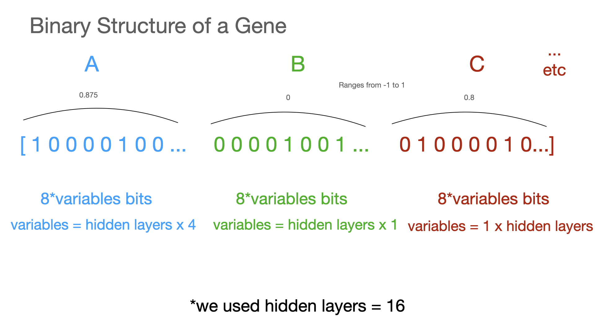

<iframe width="560" height="315" src="https://www.youtube.com/embed/mFOKdGye7vY?si=sZ30L3uJBAeZhTZl" title="YouTube video player" frameborder="0" allow="accelerometer; autoplay; clipboard-write; encrypted-media; gyroscope; picture-in-picture; web-share" referrerpolicy="strict-origin-when-cross-origin" allowfullscreen></iframe>

[Link to code for project on github](https://github.com/sm5art/genetic-pong)

# Introduction

When approaching a machine learning problem, a clear definition is key. Next, mathematical modeling and algorithmic optimization come into play to fine-tune the model's parameters. In this blog, we'll delve into one specific type of unsupervised learning: **genetic algorithms**. Introduced by John Holland in 1960, inspired by Charles Darwin's theory of evolution, these algorithms have been gaining traction in various fields such as quant finance and various control theory objectives like robotics and also science fields like medicine/and materials. Here, we'll explore how a genetic algorithm can be applied to the classic game of Pong, allowing us to play it unsupervised. In this post, we'll first set the context for our problem and then dive into the implementation details later on. This blog assumes some basic knowledge of linear algebra and some basic python programming knowledge.


# The Problem (The Environment)

When I was in college my friend came to me with a really cool project he was working on: he recreated the classic game of pong in python and was showing me how you can have two players playing simultaneously using different keys on the keyboard. He asked me if its possible to recreate an AI in his game and I set out to explore the potential solutions. I thought of a few ideas, you could try to just create a pretty simple program that would tell the opponent paddle to move up and down based on the position of the ball relative to the paddle and figure out the correct parameters but I set out to explore more potential solutions here using genetic algorithms.


The environment of the game of pong consists of two concepts: the state of the game and the actions that either player can take in the game. The state of the game of pong is outlayed by the display shown the the user the 1280x720 output which is only one valued here since the game is mostly unichannel/unicollor, we can assume a pretty simple game space for the game state. But even here we can abstract more features out of this by knowing that we have memory access to the balls position and players position, we can abstract even more simple features than the game screen which allow for more robust and quicker learning. The actions that could be taken in the game are represented by the mainly three actions/controls the player has at any time while playing the game: moving up, moving down, doing nothing.

# Modeling The Problem

In this section we are solving the sub-problem of coming up with the inputs and outputs of our model such that we get a model that will suit our specific task of figuring out when to move a pong paddle up or down in relation to the game state.

**The problem** - Designing a function that takes any given information from the game state that outputs the ideal action. Mathematically what this model looks like is a function with a domain (input values) that spans the game state and a range (output values) that spans the possible actions.

## How do we model?

A model has input features and outputs which are designed based on what the problem specifies. We will be using linear algebra to drive the "unknown" part of this model.

```
i.e. y = Ax+B
x - game state
y - outputs
A, B - unknown
```

## The game state (inputs)

Since the pong game is written in python we have direct memory access to the ball and paddle speed and direction in the x/y direction which we will be using in the engineering of the inputs/game state. The game state will change every frame of the game which will plug into the model to decide the optimal output. The inputs are normalized to reduce weight explosions when optimizing.
*Note: Max Speed and Screen Height are constants defined in the code and could be changed*


This image is showing us the inputs I have chosen to engineer in to this model from the game state, the v<sub>y</sub>, v<sub>x</sub> variables are retrieved by taking the speeds that are being used actively in the frame in the game shown in the code here. *The code is available for download above and [here](https://github.com/sm5art/genetic-pong) on github so you can run the pretrained version on your own computer or run the training yourself*


ball.py
```
class Ball(object):
	
	def __init__(self, screen,x,y,size,x_speed,y_speed, color):
		
		self.screen = screen
		self.x = x
		self.y = y
		self.size = size
		self.x_speed = x_speed
		self.y_speed = y_speed
		self.color = color

	def move(self):
		self.x+=self.x_speed
		self.y+=self.y_speed
		if (self.y <= 0 and self.y_speed < 0):
			self.y_speed = -self.y_speed
		elif (self.y+self.size >= HEIGHT and self.y_speed > 0):
			self.y_speed = -self.y_speed
		self._draw()

	def _draw(self):
		pygame.draw.rect(self.screen, self.color,[self.x,self.y,self.size,self.size])
```
Similiar with the paddle we can get the variables through the code/memory during gameplay like this.


paddle_object.py
```
class paddle(object):

    def __init__(self,screen,x,y,length,width,player,speed,weights=None):
        self.length = length
        self.width = width
        self.x = x
        self.y = y
        self.player = player
        self.screen = screen
        self.speed = speed
        if weights is not None:
            self.weights = np.array(weights)
            self.A, self.B, self.C, self.D = format_weight_array(self.weights)
        else:
            weights = np.array([1, 1, 1, 1, 1])
        self.config = {'one': {'w': pygame.K_i, 's': pygame.K_k}, 'two': {'w':pygame.K_w, 's':pygame.K_s }}

    def _draw(self, color=(255,255,255)):
        pygame.draw.rect(self.screen,color,[self.x,self.y,self.width,self.length])

    def _move_down(self, multiplier=1):
        if self.y+self.length<=HEIGHT:
            self.y += multiplier*self.speed
        
    def _move_up(self, multiplier=1):
        if self.y >= 0:
            self.y -= multiplier*self.speed
```


## The actions (outputs)

The outputs for **the problem** is the pong paddle's direction of action.


Here we have a pretty simple output space which is represented by one scalar value y. If the y value is above a specified threshold constant called c the pong paddle will be coded to move up in the game against the input space. If the y value is below this specified constant c the pong paddle will be programmed to move down. Otherwise in the range between these values just leave the paddle doing nothing for that frame.

paddle_object.py
```
class paddle(object):
    ....
    def move_kb(self, color=(255,255,255)):
        keys = pygame.key.get_pressed()
        if keys[self.config[self.player]['w']]:
            self._move_up()
        elif keys[self.config[self.player]['s']]:
            self._move_down()
        self._draw(color=color)

    def move_ai(self, ball):
        X = prepare_features(ball.x_speed, ball.y_speed, ball.y, self.y)
        decision = nn(self.A, self.B, self.C, self.D, X)
        if decision > 0.1:
            self._move_up()
        elif decision < -0.1:
            self._move_down()
        self._draw()
```

## Algebra of a Neural Network

I used a simple neural network with one set of hidden layers to model the behavior of the paddle.

Dimensions of variables

*Note: hidden layers is a constant that is chosen and can be changed to improve performance or add more complexity/parameters to the model*

```
x: 4x1 (game state/domain)
y: 1x1  (actions/range)
A: # hidden layers x 4 (unknown weights)
B: # hidden layers x 1 (unknown bias)
C: 1 x # hidden layers (unknown weights)
D: 1x1 (unknown bias)
```

This is the model I engineered after a few attempts including linear regression. The weights and bias A, B, C, D are all unknown and will be optimized for in the next section of the blog.

Here is the model code

model.py
```
import numpy as np
from genetic import Gene

input_size = Gene.input_size
hidden_size = Gene.hidden_size

def forward_model(A, x, C):
    return np.tanh(np.dot(A, x)+C)


def nn(A, B, C, D, x):
    return np.tanh(np.dot(C, np.tanh(np.matmul(A, x) + B)) + D)


def format_weight_array(array):
    A = np.array(array[:hidden_size*input_size]).reshape((hidden_size, input_size))
    B = np.array(array[hidden_size*input_size:hidden_size*(input_size+1)])
    C = np.array(array[hidden_size*(input_size+1):hidden_size*(input_size+2)])
    D = np.array(array[hidden_size*(input_size+2)])
    return A, B, C, D
```

# The Genetic Algorithm

## Why is this even necessary?

As I mentioned in the previous section, we have 4 weights and bias terms that we need to optimize for yet we don't have a labeled data set that represents what a pong player should do depending on these inputs. This will require the usage of an unsupervised learning algorithm which will evaluate the progress of learning through a different heuristic. The genetic algorithm draws many simularities to the monte carlo method, although it uses extra genetic based heuristics to guide beyond the method of just randomly guessing and checking as monte carlo does to find best parameters (solution) to the problem/model.

## Basic structure of any genetic algorithm
The basic structure of a genetic algorithm contains:
* A chromosome which expresses a possible solution to the problem (parameters) as a easily breedable object in the context of a genetic algorithm. 
* A fitness function which takes a chromosome as input and returns a higher value for what we consider is a better solution (make it much more likely to reproduce)
* A population which is just a set of many chromosomes, typically randomly generated initially and bred into subsequent populations
* A selection method which determines how parents are selected for breeding from the population
* A crossover operation which determines how parents combine to produce offspring
* A mutation operation which determines how random deviations manifest themselves

## What is a chromosome? (context of a genetic algorithim)
A chromosome is an abstract representation of the parameters of the model in such a way that each chromosome can be bred with another chromosome to produce another chromosome that has features extracted from the two parent chromosomes to allow for exploration for the solution in the algorithm. In our model above, we are mostly looking at inputs in the range of floating numbers from -1 to 1 and expecting outputs in a similar sort of range of -1 to 1 floating. We must design our chromosome structure to support floating point weights for the A, B, C, D weights in the model such that the ranges will align with the inputs/outputs but also can be stored in a "chromsomal" that can be easily bred. 

Let's take a quick look at the code to see more.
```
"""
Gene class contains a class to represent a pong paddle's alleles and to easily convert them 
to decimal numbers so that you can use the values in inference as well as in training the algo
w/ crossover and mutation.
"""
class Gene(object):
    n = 8 # how many alleles should I use to represent one number 
    hidden_size = 16 # how many hidden layer you want, positively correlated w/ size of allele
    input_size = 4 # how many inputs there are, positively correlated w/ size of allele
    var = input_size*hidden_size + 2*hidden_size + 1 # total number of variables to account for based on NN model
    weight_min = -1
    weight_max = 1
    def __init__(self, alleles=None):
        if alleles:
            self.alleles = alleles
        else:
            self.alleles = [random.randint(0, 1) for i in range(Gene.var*Gene.n)]

    # get decimal number array of length var from binary allele representation
    def numpy_values(self):
        vals = []
        for i in range(Gene.var): # the next line looks really complicated but all it does is convert to binary
            vals.append(          # and then normalize between weight_min and weight_max
                int("".join(
                    [str(g) for g in self.alleles[i*Gene.n:(i+1)*Gene.n]]), 2) 
                * (Gene.weight_max-Gene.weight_min)/2**Gene.n + Gene.weight_min )
        return np.array(vals)
```

Here is a quick diagram showing what the code is doing above. The Gene object is responsible for holding a representation of the weights of the model in an "allele" like format which is structured here as a binary list of 1 and 0s with a specified length based on the amount of variables and precision specified. The reason why we store our weights in this format is to have an easy representation for comparing and breeding between two different Gene objects representing different weights. The numpy_values functions provides a mapping between the allele format stored internally and creating the float representation used in the matrix calculation at runtime to calculate the decision from the game state. This function takes the alleles that were initialized for the amount of inputs and outputs and hidden size of the model and will output the proper floating decimal numbers that will represent the A, B, C, D matrix values.


## What is a population?
A population is just a set of chromosomes that are bred to produce the next generation. We use the Generation class in our project to manage the population of genes. Below I show the code, where we have an init function that could have genes specified or not. If genes is not specified, we randomly generate a population of genes with a size of the specified parameter initial_population. If it is then we just create this generation with the specified gene objects (usually produced from a subsequent breeding of last generation). The point of this class is to keep track of a lot of gene objects in relation to each other while tracking their fitness so that we can reproduce them into subsequent generations.
How is it initialized?
```
"""
The Generation class contains a class used keep track of the current generation of the training sequence of paddles. 
The Generation class assumes that you setup the training conditions such that you have one large right paddle that fills up the screen.


Params:
    initial_population (int) - the starting size of your generation 1 paddles

"""
class Generation(object):
    def __init__(self, initial_population, right_paddle, screen):
        self.P = initial_population
        self.right_paddle = right_paddle
        self.screen = screen
        self.generation = 0
        self.init()

    def init(self, genes=None):
        self.train_paddles = []
        self.dead = False
        self.generation += 1
        if genes:
            for i in range(len(genes)):
                color = [100, 100, 100]
                mod = i%3
                color[mod] = i % 255
                a = Train(color, self.screen,SPACING,HEIGHT/2,P_LENGTH,P_WIDTH,'two',P_SPEED, gene=genes[i])
                a.one = self.right_paddle
                self.train_paddles.append(a)
        else:
            for i in range(self.P):
                color = [100, 100, 100]
                mod = i%3
                color[mod] = i % 255
                a = Train(color, self.screen,SPACING,HEIGHT/2,P_LENGTH,P_WIDTH,'two',P_SPEED)
                a.one = self.right_paddle
                self.train_paddles.append(a)
```

Here is the Train object that is being referenced here which instantiantes a pong paddle with its own ball for training. The training scenario includes many independent paddles battling against a wall on the right side which would bounce the ball back at a random angle. The goal of the gene/train function is to try to hit back the ball as many times against this random wall as possible, being counted by the Generation module.
```
"""
The train class is a class that represents an instance of the paddles used in the training sequence.
The argument to look closely at in the context of the algorithim is the gene Variable which will contain
the information that represents the behavior of that paddle.
"""
class Train(object):
    def __init__(self, color, screen,x,y,length,width,player,speed, gene=None):
        self.color = color
        self.paddle = paddle(screen,x,y,length,width,player,speed)
        self.ball = Ball(screen,WIDTH/2,HEIGHT/2,20,-5,random.choice([-5, 5]), color)
        self.dead = False
        self.fitness = 0
        if gene:
            self.g = gene
            self.F = self.g.numpy_values()
            self.A, self.B, self.C, self.D = format_weight_array(self.F)
        else:
            self.g = Gene()
            self.F = self.g.numpy_values()
            self.A, self.B, self.C, self.D = format_weight_array(self.F)

    def move(self, decision):
        if decision > 0.1:
            self.paddle._move_up()
        elif decision < -0.1:
            self.paddle._move_down()
        self.paddle._draw(color=self.color)

    def on_update(self):
        if self.dead:
            return
        self.ball.move()
        if (self.ball.x <= 0 or self.ball.x+self.ball.size/2 >= WIDTH):
            self.dead = True
            return
        if self.check_collision(self.paddle):
            self.fitness += 1
        self.check_collision(self.one, train=True)
        X = prepare_features(self.ball.x_speed, self.ball.y_speed, self.ball.y, self.paddle.y)
        self.move(nn(self.A, self.B, self.C, self.D, X))

    def check_collision(self, paddle, train=False):
        if self.ball.collide(pygame.Rect(paddle.x, paddle.y, paddle.width, paddle.length)):
            self.ball.bounce(MAXSPEED,MAXBOUNCEANGLE, paddle, train=train)
            return True
        return False

def prepare_features(ball_dx, ball_dy, y_ball, y_paddle):
    return np.array([ball_dy/MAXSPEED, ball_dx/MAXSPEED, (y_ball-y_paddle)/HEIGHT, y_paddle/HEIGHT])
```

## What is a fitness function?
The fitness function takes in a chromosome and returns a value which is used to determine how likely it is for that chromosome to be reproduced into the next generation. The higher the value, the more likely it will be selected as a parent. Here the fitness was counted by the training function for each gene which would count how many times the paddle would successfully hit the ball back towards the wall on the right. The fitness value is updated here in the Train class:
```
class Train(object):
    ...
    def on_update(self):
        if self.dead:
            return
        self.ball.move()
        if (self.ball.x <= 0 or self.ball.x+self.ball.size/2 >= WIDTH):
            self.dead = True
            return
        if self.check_collision(self.paddle):
            self.fitness += 1 <--------------
        self.check_collision(self.one, train=True)
        X = prepare_features(self.ball.x_speed, self.ball.y_speed, self.ball.y, self.paddle.y)
        self.move(nn(self.A, self.B, self.C, self.D, X))
```

## What is a selection function?
The selection function takes in a population and returns a subset of the population which are the parents of the next generation. It is up to you how you implement this but we recommend using a tournament selection with elitism to select the best chromosomes from the previous generation. This would let a generation of Train classes of many different genes run for as long as until the last paddle dies (ball falls through it) or until many of the paddles reach the maximum fitness score of 40. Once we reach the end, we simply choose the top genes from the pool with the highest fitness and breed those into the next generation. Here is the code in the Generation class that handles the selection of the genes into the subsequent generations:
```
class Generation(object):
    ...
    # this method returns a new generation of those who had the best fitness of the dead paddles
    # it choses the highest two fitness scores and crossbreeds these two
    def selection(self):
        if not self.dead:
            return
        new_generation = []
        fitness = [(i, paddle.fitness) for i, paddle in enumerate(self.train_paddles)]
        fitness = sorted(fitness, key=lambda x: x[1])
        top_n_n = 40
        fit_list = fitness[-top_n_n:]
        random.shuffle(fit_list)
        top_n = top_n_n//2
        for i in range(top_n):
            myself = self.train_paddles[fit_list.pop()[0]].g
            mate = self.train_paddles[fit_list.pop()[0]].g
            son = myself.crossover(mate, n_children=20) # woah calm down there assuming genders
            new_generation += son
        self.init(genes=new_generation)

```

## What is a crossover function?
The crossover function takes in two parent chromosomes and returns two child chromosomes. The parents are selected by the selection function, so you can use any method to select them.
Here is the code describing the crossover function:
```
class Gene(object):
    ...
    def _crossover(self, other):
        alleles = []
        for i in range(Gene.var*Gene.n):
            if random.randint(0, 1) > 0:
                alleles.append(self.alleles[i])
            else:
                alleles.append(other.alleles[i])
        alleles = self._mutate(alleles)
        return Gene(alleles=alleles)

    #returns list of children (Gene object)
    # crossover will create crossover with the self and other for a total of n_children times 
    # returns a list of Genes in size n_children
    def crossover(self, other, n_children=50):
        lst = []
        for i in range(n_children):
            lst.append(self._crossover(other))
        return lst

```
Here is a diagram describing the crossover logic in the function above on how two parent genes crossover to form a child gene:


## What is a mutation function?
The mutation function takes in a chromosome and returns a new chromosome which is a mutated version of the original one. This is used above in the crossover to introduce some randomness during breeding which allows for more exploration during training.
Here is the code:
```
class Gene(object):
    ...
    # default chance of mutation is 1%
    def _mutate(self, alleles, chance=0.01):
        new_alleles = []
        for i in range(Gene.var*Gene.n):
            if random.random() < chance and i % Gene.n != 0:
                stored = new_alleles.pop()
                new_alleles.append(alleles[i])
                new_alleles.append(stored)
            else:
                new_alleles.append(alleles[i])
        return new_alleles
```

# References

1. https://github.com/Sarthak-Rijal/goodpong 
2. https://en.wikipedia.org/wiki/Genetic_algorithm 
3. https://www.geeksforgeeks.org/genetic-algorithms/
