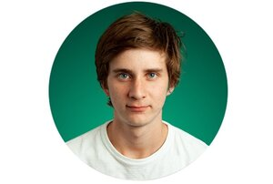

# About me

I'm a software engineer based in **Seattle, WA** who enjoys studying algorithims. I am currently a junior at the **University of Washington** studying Applied Physics and have had industry experience working as a Python/Javascript engineer. Most recently I was a full stack JS engineer at **Heali.ai**. I currently work on a blog posting about algorithim/AI concepts.

## Technologies i've been working with
* typescript/react/redux
* serverless (AWS Lambda)
* redis
* mongoDB
* tensorflow

